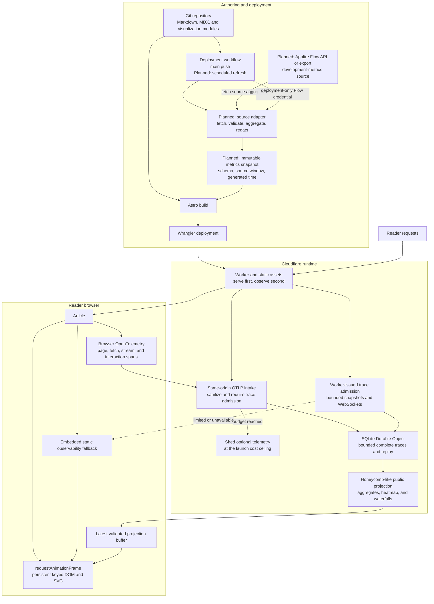
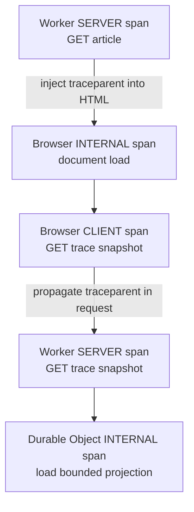

# Architecture, privacy, and bounds

## Architecture map

The architecture has two data planes. Runtime observability measures the public site with joined browser and server [OpenTelemetry](https://opentelemetry.io/) traces while it serves readers. Deployment-time development metrics will be fetched and reduced once, then shipped as an immutable static snapshot. The planes share the Astro publishing path and per-post visualization boundary, but they do not share credentials, persistence, or failure handling.

Nodes prefixed with `Planned:` remain unimplemented. The runtime plane now instruments the article, joins browser, Worker, and Durable Object spans, rejects telemetry outside the public schema, sheds optional work at explicit request and connection ceilings, assembles complete traces, derives bounded projections, replays them over one hibernating WebSocket, and renders the aggregates and waterfall at browser cadence. The development-metrics adapter and scheduled snapshot refresh remain open. The older tail-latency article and tables remain a separate prototype until its removal is validated; the observability post no longer reads them.

The plane boundary is recorded in [the two-data-plane decision](decisions/0001-separate-runtime-and-deployment-metrics.md). [The bounded OpenTelemetry decision](decisions/0002-use-bounded-opentelemetry-for-runtime-self-observation.md) records the distributed-trace join, persistence, and recursion cutoff. The development plane deliberately keeps its source replaceable: [Appfire Flow](https://appfire.com/flow/info) is scheduled for retirement on 31 December 2027, although Appfire says existing API functionality remains available during the supported period.

## Post data planes

### Runtime observability

The observability post uses real joined traces, not synthetic activity. Its machinery instruments its own page load, hydration, fetches, stream connection, projection reduction, and rendering. A single reader therefore produces enough browser and server spans for an honest low-traffic visualization. When nobody visits, the presentation window drains to an honest empty state.

#### Client–server parentage

The initial article response and later browser calls use [W3C Trace Context](https://www.w3.org/TR/trace-context/) rather than timestamp correlation. The Worker starts the initial server root and injects its active `traceparent` into the HTML. Browser document-load instrumentation continues that context. For each later request, the browser creates a client span and propagates its context in the request; the Worker extracts it and starts a remote server child. Durable Object work is an internal child below that server span.

Every stored span has a lowercase W3C-sized `traceId`, `spanId`, and optional `parentSpanId`. The shared `traceId` joins the distributed trace; `parentSpanId` preserves the exact browser-to-server edge. Finalized traces require one trace ID, one root, unique span IDs, resolvable parents, and no parent cycles. Parent-based sampling follows the root decision so an admitted trace is coherent rather than a collection of unrelated sampled spans. The public view displays the active sample rate.

Browser spans are exported to a same-origin OTLP/HTTP endpoint. The article response carries an opaque admission token bound to its Worker-issued trace ID in the Durable Object. Each token expires after five minutes and permits at most eight browser batches; the object issues at most ten admissions per second and retains at most 120 active admissions. A valid OTLP document without that binding receives `403` before storage.

The Worker converts accepted payloads into the strict schema in [src/domain/public-span.ts](../src/domain/public-span.ts) and discards raw OTLP. Worker instrumentation sends its server and internal spans through the same bounded store without making a network round trip. Each enumerated operation fixes its span kind, runtime side, service name, and exact low-cardinality attribute object; the shared envelope permits only trace identity, start time, duration, and status. Full URLs and query strings, IP addresses, user agents, headers, referrers, user identifiers, bodies, secrets, arbitrary operations, and arbitrary attributes fail validation. The deterministic joined trace in [src/domain/fixtures/public-spans.ts](../src/domain/fixtures/public-spans.ts) is the shared contract fixture for instrumentation, storage, projections, and page rendering.

Persistence is trace-shaped. The Durable Object allows five seconds for out-of-order assembly, then retains complete traces for five minutes: at most 120 traces, 16 spans per trace, and 960 spans in total. Expiry and capacity eviction delete whole traces so the visualization never presents a broken waterfall. The current projection and at most 61 replay projections are separate bounded read models; they do not copy raw spans into another archive.

The projection reports trace and span counts, error count and rate, `P50`, `P95`, and maximum span duration. It groups the same aggregates by runtime side and service, fills ten fixed duration buckets, and selects at most five slow traces with at most 16 waterfall spans each. [src/domain/public-observability.ts](../src/domain/public-observability.ts) owns that versioned contract. [src/domain/public-observability-sql.ts](../src/domain/public-observability-sql.ts) owns the singleton current projection, replay bounds, dirty cadence state, and restart recovery.

The recursion has a deliberate cutoff. Browser and Worker auto-instrumentation exclude the OTLP intake route. Telemetry ingestion, projection application, and the telemetry visualization’s paint loop do not export spans into the canonical stream they display. The page may show its final paint as a labeled local-only span, but exporting it would create an endless self-observation loop.

Serving the article remains the primary path. Recording telemetry is an optional side effect: if ingestion reaches its budget, the Worker skips the sample and still serves the asset. Snapshot and WebSocket admission have their own ceiling. A denied connection, an unavailable Durable Object, or invalid live state leaves the embedded fallback visible rather than making the article fail.

The viral-load contract is therefore:

- static assets continue to serve;
- telemetry writes, projection cadence, replay, and accepted realtime connections have explicit ceilings;
- storage remains physically bounded by the presentation window and whole-trace caps;
- browsers coalesce projections at paint cadence;
- live-data failure degrades to a labeled static or last-valid view.

The root sampler admits the first ten eligible article traces in each one-second window while preserving 100% sampling at ordinary low traffic. It retains at most 120 active admission tokens. Each admitted trace may send eight browser batches of no more than 64 KiB, while the shared intake accepts at most 40 valid batches per second. Snapshots admit 30 requests per second. WebSocket admission permits ten successful handshakes per second and 64 simultaneous public sockets across both streams. A rejected optional operation receives `429` with `Retry-After`; article HTML still serves with its embedded fallback when admission is denied or the Durable Object is unavailable.

Four singleton fixed-window rows persist these request counters across hibernation without an unbounded request log. Sampling decisions use separate five-second buckets, capped at 61 rows and five minutes. Accepted roots are exact up to the ten-per-second ceiling. Once a root window is exhausted, the budget row records only its first rejection; later rejects in that window perform no telemetry write. The public view therefore marks the displayed admission percentage as an upper bound and the dropped count as a lower bound whenever any shedding occurred. Invalid and oversized traces contribute to the dropped lower bound but do not distort the root-sampling numerator.

The OpenTelemetry JavaScript browser packages remain experimental even though the underlying tracing API is stable. Browser instrumentation therefore stays behind a narrow adapter with deterministic fixtures, so package changes do not leak into article code or the public span schema.

### Deployment-time development metrics

A deployment job obtains aggregate development data through a source adapter, validates and reduces it, removes fields that are not explicitly public, and emits a small immutable snapshot into the Astro build. The browser downloads that snapshot as a static asset; it never contacts Flow and never receives its credentials.

Every snapshot must declare:

- a schema version;
- when it was generated;
- the source measurement window;
- the allowlisted aggregate metrics;
- enough provenance to explain the calculation without exposing private source records.

A source or validation failure blocks the new deployment and leaves the previous successful deployment intact. The build must not silently publish an old snapshot as current. The article displays the snapshot time and measurement window so “current” has a precise meaning.

Main-branch deployments refresh the snapshot. A scheduled deployment may refresh it without a content change when the chosen reporting interval requires that. The exact Flow API or export contract remains unresolved until the active account’s supported interface can be inspected; source-specific fields must stay inside the adapter.

### Shared presentation boundary

Each post owns its explanatory prose and purpose-built visualization. Runtime projections and deployment snapshots keep separate typed schemas, but both arrive at the visualization as bounded, validated, public data with an explicit time window. This is a small interoperability boundary, not a general chart catalogue or shared analytics warehouse.

## Standing realtime architecture

- WebSocket handlers: may parse, enqueue, or store projections; must not redraw the UI directly.
- Rendering: browser-cadence rendering with coalesced updates.
- Storage collections: complete traces, current projections, and replay projections stay within the declared presentation window and row caps.
- Genuine timing validation: exercise actual Worker requests, including bursts, retries, duplicate projections, and out-of-order projections; do not invent telemetry activity for the public view.
- Tests: deterministic reducer/projection tests, actual SQLite row-count tests, and rendered-page inspection under streaming load.
- Required flow: `event stream -> reducer/domain core -> bounded projection -> latest projection buffer -> requestAnimationFrame render loop -> keyed/persistent SVG/DOM updates`.
- Every public stream declares one presentation window; raw rows, projections, replay, snapshots, and rendering enforce that same window.

This is a repository invariant, not a tail-latency preference. Each public stream declares its duration, capacity, replay, and broadcast limits in its domain definition. A new stream is incomplete until actual SQLite tests overfill both time and capacity and prove that projection, rendering, and physical storage enforce the same declaration.

## Observability presentation window

`PUBLIC_TRACE_STREAM` declares a five-minute window, five-second assembly grace, five-second projection cadence, 120-trace cap, 16-span per-trace cap, 960-total-span cap, and 61-projection replay cap. `public_traces` stores trace deadlines and finalization state; `public_spans` stores only sanitized span payloads keyed by trace and span ID. Late changed spans reopen a trace for another grace interval. Exact duplicates do not.

The alarm deadline is the earliest pending trace finalization, whole-trace expiry, projection cadence, replay or drop-counter expiry, or legacy tail-latency deadline. It survives object hibernation and process restart. Snapshot and WebSocket recovery run retention before reading. A browser older than replay receives the current projection; a browser with an overlapping sequence receives only later valid projections. The browser keeps one latest-value buffer, coalesces updates in `requestAnimationFrame`, and replaces disconnected data with an honest empty projection when its five-minute window expires.

The storage bounds are:

- `public_traces`: at most 120 rows in the five-minute window;
- `public_spans`: at most 960 rows, with no trace exceeding 16 rows;
- `observability_projection_state`: exactly zero or one row;
- `observability_projection_replay`: at most 61 rows in the same five-minute window;
- `browser_trace_admissions`: at most 120 active rows, each expiring with the presentation window.
- `public_request_budgets`: exactly zero to four singleton window rows;
- `observability_sampling_buckets`: at most 61 five-second rows in the presentation window.

## One presentation window

The tail-latency stream presents the inclusive interval `[now - 60 seconds, now]`, capped at the newest 300 points. Its one-second broadcast cadence derives a maximum of 61 replay projections for that same interval. These values are declared once in `TAIL_LATENCY_STREAM`; reducers, SQLite retention, snapshot and replay recovery, browser filtering, chart geometry, and expiry scheduling consume that definition.

`src/domain/public-stream.ts` owns the definition and pure selection rules. `src/domain/public-stream-storage.ts` owns the storage enforcement interface. It hides the physical store behind five deletion operations, so the policy can be tested against real SQLite without coupling the domain to Cloudflare APIs. `src/worker/index.ts` implements those operations for Durable Object SQL and invokes them inside `transactionSync`.

Rows with timestamps before the cutoff or after `now` are physically deleted. Remaining sample rows are capped at 300 by observation time and insertion ID. Each replay row stores the timestamp of its oldest payload point; the row is deleted when that point crosses the cutoff. Replay is capped at 61 rows. Legacy rows with unknown coverage are unsafe and deleted. The current projection is rebuilt from surviving sample rows. The next hibernating alarm is the earlier of a pending cadence flush and one millisecond after the oldest point reaches the inclusive boundary. Expiry therefore continues when traffic pauses, without an in-memory interval.

Snapshot and WebSocket admission run retention before reading storage. They cannot return an expired current payload or replay frame. The browser applies the same selector again and schedules its own presentation-only expiry repaint, so a disconnected or quiet page does not display an aged point while waiting for another server projection.

## Ownership and flow

`src/domain/public-span.ts` owns the storage-safe span vocabulary and complete-trace invariants. `src/domain/public-trace-store.ts` owns assembly, whole-trace eviction, and alarm policy. `src/domain/public-observability.ts` owns the versioned aggregates, heatmap, slow-trace, waterfall, snapshot, and stream-envelope contracts. None of these modules performs I/O.

`src/worker/index.ts` owns Cloudflare I/O. It issues trace admissions, converts public OTLP, records server spans, invokes trace and projection storage inside Durable Object transactions, serves `GET /api/observability/snapshot`, and fans the `observability` envelope out through the hibernating `GET /api/stream` socket.

`src/visualizations/observability-stream.ts` owns the observability page’s snapshot, WebSocket recovery, latest validated projection, disconnected expiry, and browser-cadence notification. `src/visualizations/observability.ts` owns persistent aggregate, heatmap, selector, and SVG waterfall nodes. Reducer application and final paint are local-only spans, so applying the projection cannot feed the stream it displays.

### Tail-latency prototype

`src/domain/tail-latency.ts` owns the strict sanitized input schema and version 2 public projection. It receives keyed, allowlisted samples and emits ordered `{ key, durationMs, observedAt }` points plus `p50Ms`, `p95Ms`, `maxMs`, count, sequence, and generation time. It performs no I/O.

`src/worker/index.ts` owns measurement and Cloudflare I/O. The Worker measures only static-asset fetch duration. One SQLite-backed Durable Object named `public` owns ordering, physical retention, the singleton current projection, bounded replay, hibernating alarms, and WebSocket fan-out. It broadcasts no more than once per second; an in-cadence burst schedules one persisted flush.

`src/visualizations/page-stream.ts` owns the single page connection. The first slice admits exactly one stream, `tail-latency`. The public socket is `GET /api/stream?streams=tail-latency&since=<sequence>`. The message handler validates and stores only the latest projection. One `requestAnimationFrame` callback coalesces arrivals before notifying active visualizations. An `IntersectionObserver` and page-visibility check close the connection while the chart is off-screen.

`src/visualizations/tail-latency.ts` owns article-specific rendering. It updates persistent area and line paths plus one amber latest-point circle; historical requests remain in path geometry without separate DOM nodes. One animation controller interpolates toward the newest eligible geometry, coalesces an in-flight replacement from the last painted frame, and owns at most one animation frame. It cancels work off-screen and applies updates immediately when `prefers-reduced-motion` is active. It never replaces the SVG or renders a point outside the declared window. The server-rendered version 2 projection remains as the static fallback.

## Sequence and recovery

Each broadcast receives a monotonic sequence. The browser fetches the current snapshot, then opens the WebSocket with that sequence in `since`. On reconnect, the object replays later retained projections only when the client overlaps replay storage. A new client, a missing range, a client older than the retained range, an expired range, or a malformed stored payload receives the current validated snapshot. Missing old history is expected and is not repaired from another database.

Sequence 0 is the static fallback and the no-live-projection sentinel. The browser rejects duplicate and out-of-order sequences. Expiry may rebuild the persisted current payload at the existing sequence; browser-side expiry removes the same aged points immediately, and the next cadence projection carries the next sequence.

## Tail-latency prototype contract

Only these fields enter storage:

- `durationMs`: non-negative and capped at 60 seconds;
- `observedAt`: integer timestamp and the retention key;
- `routeClass`: `home`, `article`, `asset`, or `other`;
- `statusClass`: `2xx`, `3xx`, `4xx`, or `5xx`.

The strict schema rejects extra fields. The engine never retains request paths, query strings, IP addresses, user agents, headers, bodies, secrets, or raw operational logs. Browsers are read-only; a client WebSocket message closes that connection as a policy violation.

## Storage growth audit

- `samples`: at most 300 rows, all in the current 60-second window;
- `replay`: at most 61 rows, all generated in that window and individually deleted when their oldest point expires;
- `current_projection`: exactly zero or one row through its singleton primary key;
- `sqlite_sequence`: one metadata row for the sample table’s `AUTOINCREMENT` counter; its row count is fixed and it contains no telemetry point;
- accepted WebSockets: hibernated runtime attachments, not historical telemetry; connection admission remains a public-launch rate-limiting gate.

The deterministic storage test inserts substantially more samples and replay rows than allowed, asserts exact SQLite row counts, and advances the clock beyond the window without inserting traffic. A new stream must provide the same proof.

## Failure behavior

- Invalid internal samples receive `400` and never enter the reducer.
- Unknown public streams receive `400`; non-WebSocket stream requests receive `426`.
- A failed delivery closes only that socket.
- Missing or invalid live state returns the static fallback.
- Malformed internal JSON receives `400`.
- Background telemetry failure does not delay the asset response.
- HTML allows scripts and styles only from the same origin; WebSockets are restricted to the page origin.

## Deliberate limits

The project has no general chart catalogue, plugin API, analytics warehouse, raw archive, or separate realtime provider. A post imports its own TypeScript visualization. The shared stream definition and retention interface enforce the repository invariant without speculating about a generic telemetry framework. A later stream still adds its schema, reducer, persistence adapter, and over-capacity/expiry tests explicitly.
